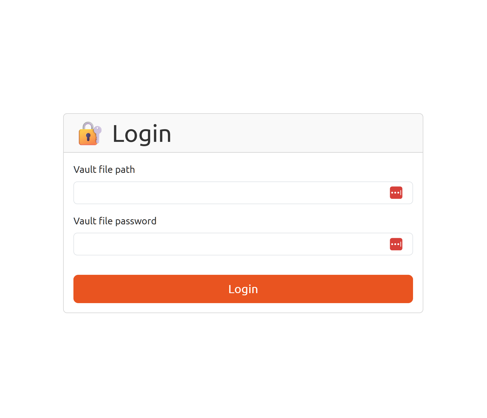
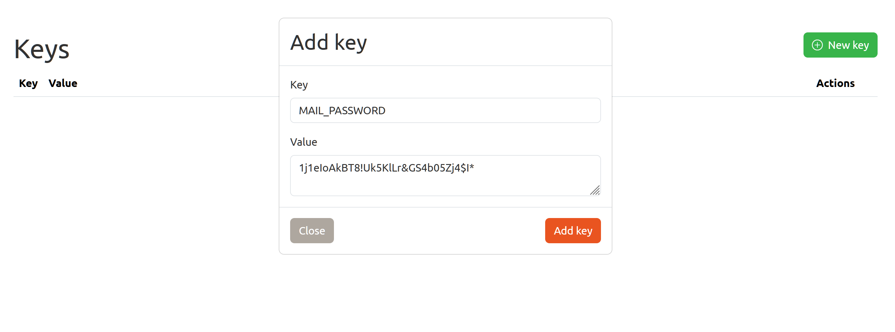
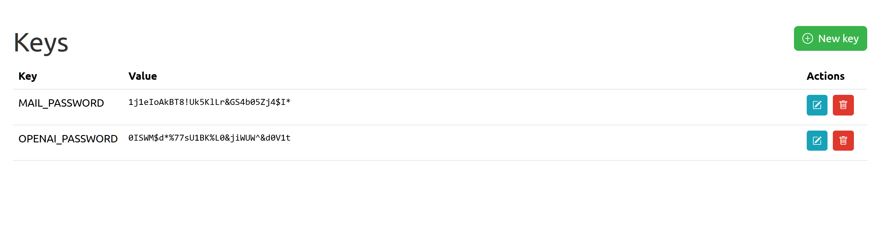
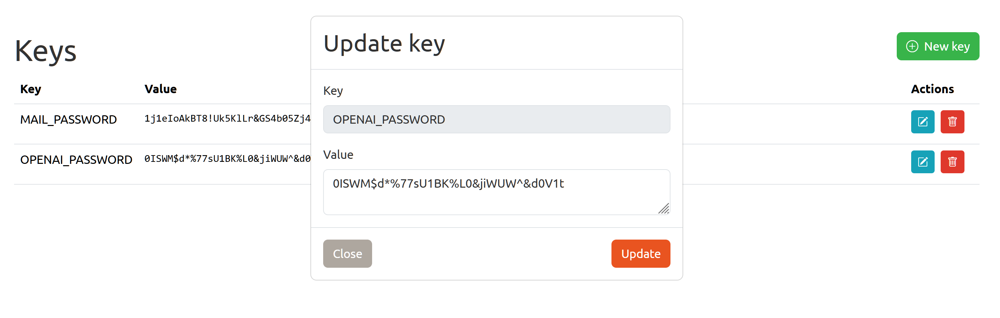
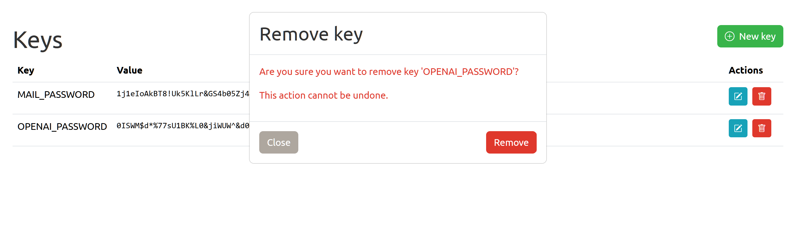

# envenc 

<a href="https://gitpod.io/#https://github.com/gouniverse/envenc" style="float:right:"></a>


## Description

Secures your .env files with a password. Works similarly to ansible-vault.

A user friendly CLI interface to create and manage .env.vault files.

In addition provides a convenient web based user interface to manage your .env.vault files.

## Usage

1. Leave your public variables in your `.env` file.

2. Create a new `.env.vault` file using envenc.

```bash
$> ./envenc init .env.vault
```

3. Add your private variables to the `.env.vault` file.

```bash
$> ./envenc key-set .env.vault
```

4. Use the vault file in your project.

```bash
$> keys := env.KeyListFromFile(password, ".env.vault")
```

## Screenshots

The web interface is simple and straightforward to use.

- Login Screen



- Add New Key



- List Keys



- Update Key



- Delete Key



## Installation

### Installation as a standalone executable (binary)

- Download the binary for your platform from the latest release

- You may install it globally, or use as standalone executable

- To use it globally on Linux, add to your `$PATH`

```bash
$> mkdir -p ~/.local/bin
$> cp envenc ~/.local/bin
$> chmod +x ~/.local/bin/envenc
```

- To use it globally on Windows, add to your `$PATH`

```bash
$> mkdir -p %USERPROFILE%\.local\bin
$> cp envenc.exe %USERPROFILE%\.local\bin
```

### Installation as a module in your project

- Install the module with `go get`

```bash
$> go get github.com/gouniverse/envenc
```


## Example Usage:

- To create a new vault file

```bash
$> ./envenc init .env.vault
```

- To set a new key-value pair

```bash
$> ./envenc key-set .env.vault
```

- To list all key-value pairs
```bash
$> ./envenc key-list .env.vault
```

- To remove a key-value pair
```bash
$> ./envenc key-remove .env.vault
```

- To obfuscate a string
```bash
$> ./envenc obfuscate
```

- To deobfuscate a string
```bash
$> ./envenc deobfuscate
```


## TODO

- https://github.com/burrowers/garble

- https://github.com/marketplace/actions/go-release-binaries

## Similar

- https://github.com/getsops/sops
- https://github.com/dotenv-org/godotenvvault
- https://github.com/romantomjak/env-vault
- https://github.com/kejrak/envLoader
- https://github.com/atrzaska/dotenc
- https://github.com/Shopify/ejson
- https://github.com/EsteveSegura/crypt
